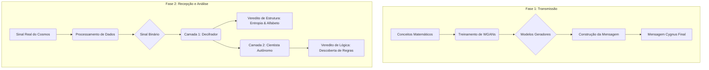

<div align="center">

<picture>
<source media="(prefers-color-scheme: dark)" srcset="https://github.com/JhonyJPHR/Projeto-Cygnus/blob/main/cygnus_banner_dark.png">
<source media="(prefers-color-scheme: light)" srcset="https://github.com/JhonyJPHR/Projeto-Cygnus/blob/main/cygnus_banner_light.png">

</picture>

<h1 align="center">Projeto Cygnus</h1>

Um framework de Inteligência Artificial ponta-a-ponta que simula a criação de uma mensagem interestelar e analisa sinais reais do cosmos em busca de estrutura, ordem e leis matemáticas ocultas.

<p align="center">


</p>

<p align="center">
<a href="#-a-missão-uma-jornada-de-ponta-a-ponta">A Missão</a> •
<a href="#-descobertas-chave-análise-do-frb-121102">Descobertas Chave</a> •
<a href="#-arquitetura-final-do-projeto">Arquitetura</a> •
<a href="#-como-executar-a-simulação">Como Executar</a> •
<a href="#-tecnologias">Tecnologias</a>
</p>
</div>

A Missão: Uma Jornada de Ponta a Ponta
O Projeto Cygnus é um ecossistema de Inteligência Artificial que explora uma questão fundamental: como podemos detetar inteligência num sinal vindo do cosmos? O projeto foi dividido em duas fases: a Transmissão (criar uma mensagem que uma IA pudesse entender) e a Recepção (criar uma IA que pudesse entender um sinal desconhecido).

Parte 1: O Transmissor (A Criação da Mensagem)
Nesta fase, ensinamos IAs a "sonhar" com matemática e codificamos esses sonhos numa mensagem robusta.

Geração de Conhecimento: Múltiplas Redes Adversariais Generativas (WGANs) são treinadas (src/generators/) para gerar representações visuais de conceitos universais: Números Primos, a Sequência de Fibonacci e a Constante de Euler.

Construção da Mensagem: Um pipeline consolidado (src/message/build_message.py) carrega esses modelos, gera os "sonhos", e monta-os numa mensagem binária final, completa com uma "Pedra de Roseta" para autodecodificação.

Abaixo, uma visualização real da mensagem gerada pela IA, com cada linha representando um conceito matemático diferente:

<div align="center">

</div>

Parte 2: O Receptor (A Análise do Desconhecido)
O coração do projeto é um sistema de análise de múltiplas camadas projetado para dissecar sinais desconhecidos. Foi testado em dados públicos do FRB 121102, uma fonte de rádio misteriosa a 3 bilhões de anos-luz.

Camada 1: O Decifrador (O Analista Forense)
O Módulo Decipher (src/decipher/) analisa a estrutura fundamental de um sinal. Ao ser apontado para os dados do FRB 121102, ele fez duas descobertas cruciais:

Estrutura Profunda: O sinal possui uma entropia extremamente baixa (0.4134), provando que não é um ruído aleatório.

Alfabeto Oculto: O Decifrador descobriu que o sinal é construído a partir de um alfabeto de 16 símbolos distintos, a base da codificação hexadecimal, uma forte evidência de uma fonte estruturada.

Camada 2: O Cientista Autônomo (O Gerador de Hipóteses)
A camada final é uma arquitetura de IA "Architect" (src/decipher/architect_hypothesis_generator.py) que gere uma equipa de IAs especialistas para deduzir as leis matemáticas por trás de um sinal.

Sucesso Controlado: Em testes, a IA conseguiu deduzir autonomamente a regra de sequências como n² e Fibonacci.

Falha Informativa: Ao analisar os dados reais do FRB, o sistema concluiu que a lógica do sinal não seguia regras simples de tendência ou oscilação. Esta "falha" foi um sucesso, pois provou que a estrutura do sinal é caótica e mais complexa do que os nossos modelos mais avançados conseguem descrever, uma conclusão consistente com a hipótese de um magnetar dinâmico.

Descobertas Chave: Análise do FRB 121102
A análise final do sinal real do FRB 121102 com o pipeline completo do Cygnus levou a uma conclusão de múltiplas camadas:

O Sinal é Artificial/Estruturado: A baixa entropia e a descoberta de um alfabeto discreto de 16 símbolos são evidências fortes de que o sinal não é um ruído natural aleatório.

A Mensagem é Caótica: A falha do Gerador de Hipóteses em encontrar uma regra matemática simples sugere que a sequência dos símbolos, embora estruturada, é caótica, semelhante ao clima ou a outros sistemas físicos complexos.

Convergência com a Astrofísica: Este resultado, obtido puramente através da teoria da informação, apoia a principal hipótese astrofísica de que a fonte do FRB é um objeto físico dinâmico e complexo (como um magnetar jovem), em vez de uma baliza de comunicação deliberada e simples.

🏗️ Arquitetura Final do Projeto
O projeto foi refatorado para ter uma estrutura modular e profissional, separando claramente as responsabilidades de cada componente.

🚀 Como Executar a Simulação
Certifique-se de que o ambiente virtual está ativo e as dependências em requirements.txt estão instaladas, usando as versões corretas (numpy==1.26.4, scikit-learn==1.2.2, gplearn==0.4.2).

1. Treinar os Geradores de Conceitos:
```bash
python -m src.generators.train_primes
python -m src.generators.train_fibonacci
python -m src.generators.train_euler
```

2. Construir a Mensagem Cygnus:
```bash
python -m src.message.build_message
```

3. Treinar o Classificador (Opcional):
```bash
python -m src.classifiers.train_classifier
```

4. Executar a Análise Final em um Sinal (Exemplo com dados simulados do GLEAM-X):

# Primeiro, gere o sinal de teste periódico
```bash
python -m src.generators.generate_gleamx_signal
```

# Depois, execute o pipeline de análise final nele
```bash
python -m src.decipher.cygnus_final_analysis sinal_gleamx.txt
```

🛠️ Tecnologias
<p align="center">
<a href="https://skillicons.dev">

</a>
</p>

🔥Próximas melhorias(Em breve):
  ° Aprendizagem por Reforço Colaborativo
  ° Meta-Aprendizagem Trans-Sinal
  ° Autoaperfeiçoamento Infinito

<p align="center">
Desenvolvido com 🧠 e ☕ por <a href="https://github.com/JhonyJPHR">JhonyJPHR</a>
</p>
